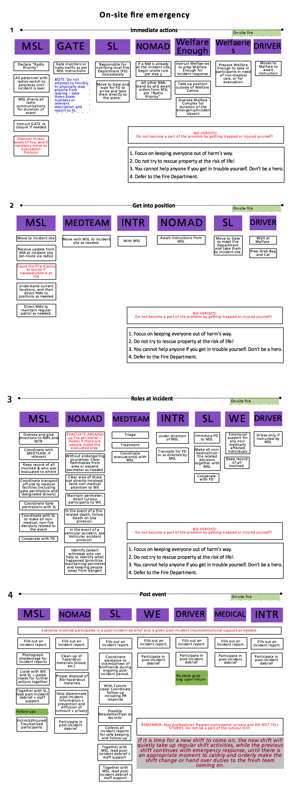
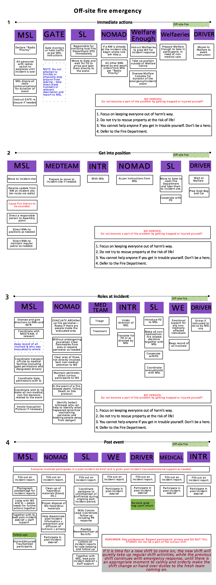

_Emergency Response Protocol:_

**Fire Emergency**

- The first course of action in a fire emergency is the immediate evacuation of the area, with the evacuation area being cordoned off, as well as Site Lead notifying local fire services to the emergency and requesting immediate assistance. Notify the Fire Department immediately – it takes them time to get to us!
- A perimeter should be established at a save distance from the fire, and the area isolated to prevent people trying to return into the area before it is deemed safe.
- Efforts should be concentrated on preventing the spread of the fire by moving anything flammable away from the fire and establishing a fire break –without risking lives while doing so.
- Grow the perimeter as needed if the fire grows until such time as the fire department arrives.
- Full cooperation with the fire department – they are in charge once they get on site.
- In case of death due to fire, follow protocols for 'Death on Site'
- If eviction of a participant is warranted in connection to a fire emergency on site, the 'Eviction Protocol' should be followed.
- Privacy of all individuals involved in the incident is to be respected at all times, and the spread of rumours should be contained – all team members to actively assist in this!
- 

## Fire onsite

## Fire offsite

­­­
