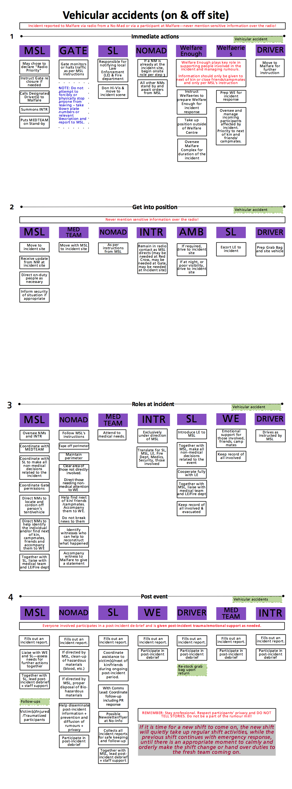

#Vehicular accidents protocol

## Definition
An accident or incident concerning one or more motorized vehicles,
including, where appropriate, [art
cars](http://www.goingnowhere.org/en/artandinnovation/artcars).

## Notes
The over-riding aim should be for the safety of individuals; those
involved as those, potentially at risk from damage.

For the avoidance of doubt, this protocol applies to the Nowhere site,
and the immediate approach to the event, or anything which may block
or hinder access to the site.

## Protocol
 - The primary concern is personal safety. Depending on the type of
 incident, there may be different risks. For fuel-carrying vehicles,
 there is a risk of fire, electrical shock in the case of poor
 grounding/earthing, and ultimately, fatalities.

 - In responding to such incidents do not put yourself or others at
 risk.

 - If there is a fire, Site Lead is to call the Firefighters. This
 needs to be relayed as soon as possible.

 - Ensure details of those involved are written down as soon as
 possible. This could be something those involved, and apparently
 physically able can do. Where information is not forthcoming, take a
 descriptive note (height, build, gender, hair colour, physical
 attributes) or photograph.

 - If there is a fatality, follow the [Death
 on-site](../death_on_site/) protocol.

 - If possible **evacuate** those involved, although if they are
 unable to move, Red Cross should be contacted to manage any
 movements, and to check-over those involved.

 - If possible, assess the vehicle for signs of damage / leaking fuel.
 If there is leaking fuel, arrange for this to be covered before fires
 start.

 - If necessary, establish an appropriate cordon for the safety of
 others.

 - Photograph the area.

 - Understand from those involved, their views on the cause. Ensure
 this is documented before turn-over.

 - The on-duty Site Lead(s) and Malfare Shift
 Lead should make a decision whether to involve law enforcement or not. Should there be disagreement, the on-duty [007 operative](../007) should be included in making this decision (aim for unanimous; proceed to above ⅔ majority).

## Relevant roles
  * Nomads
  * Gate crew (gate may need to be closed)
  * Malfare Shift Lead
  * Site Lead (to incident scene)
  * Interpreter
  * Welfare Enough (to support those involved)
  * 007 operative (if needed)

## Third parties
  * Red Cross
  * Security
  * Firefighters
  * Police

## Related protocols
  * [Death on-site](../death_on_site/)
  * [On/off-site fire](../fire_emergency/)
  * [007](../007/)

­­­
